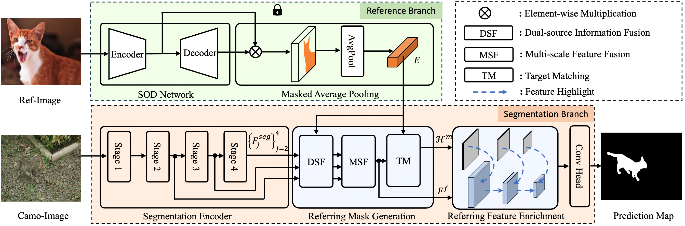

# <p align=center>`Referring Camouflaged Object Detection `</p>
This official repository contains the dataset, source code of paper 'Referring Camouflaged Object Detection'.   
In this paper, we consider the problem of referring camouflaged object detection (RefCOD), a new task that aims to segment specified
camouflaged objects based on a small set of referring images with salient target objects. 

## Get Start
<p align="center">
     <br />
</p>

&emsp; Our R2CNet framework is composed of two branches, i.e., reference branch in green and segmentation branch
in orange. In the reference branch, the common representation of a specified object from images is obtained by masking and pooling the visual
features with the foreground map generated by a SOD network. In the segmentation branch, the visual features from the last three layers of the
encoder are employed to represent the given image. Then, these two kinds of feature representations are fused and compared in the well-designed
RMG module to generate a mask prior, which is used to enrich the visual feature among different scales to highlight the camouflaged targets in our
RFE module. Finally, the enriched features are fed into the decoder to generate the final segmentation map. DSF:Dual-source Information Fusion, MSF: Multi-scale Feature Fusion, TM: Target Matching.

**0. Install**

```
conda create --name refcod python=3.8
conda activate refcod
pip install torchvision==0.13.1
pip install opencv-python
pip install opencv-contrib-python
pip install scikit-learn
pip install matplotlib
pip install tqdm
pip install tensorboard
```

**1. Datasets.**

- To reproduce our results, you should first download our ensembled [R2C7K](https://pan.baidu.com/s/1nAKETFmDiSm7dDLxlgH9tw) dataset with access code ```2023``` on Baidu Netdisk.
- Update the 'data_root' param with your R2C7K location in train.py and test.py.

**2. Test.**
- Download our pre-trained [r2cnet.pth](https://pan.baidu.com/s/1VPr1YbuZthUWMRmcKxVhvA ) checkpoints with access code 2023 on Baidu Netdisk.
- Put the checkpoint file on './snapshot/saved_models/'.
- Run ```python test.py``` to evaluate the performance of R2CNet.

## Reference
If our work is helpful to you or gives some inspiration to you, please star this project and cite our paper. Thank you!  
```
@article{zhang2023referring,
  title={Referring Camouflaged Object Detection},
  author={Zhang, Xuying and Yin, Bowen and Lin, Zheng and Hou, Qibin and Fan, Deng-Ping and Cheng, Ming-Ming},
  journal={arXiv preprint arXiv:2306.07532},
  year={2023}
}
