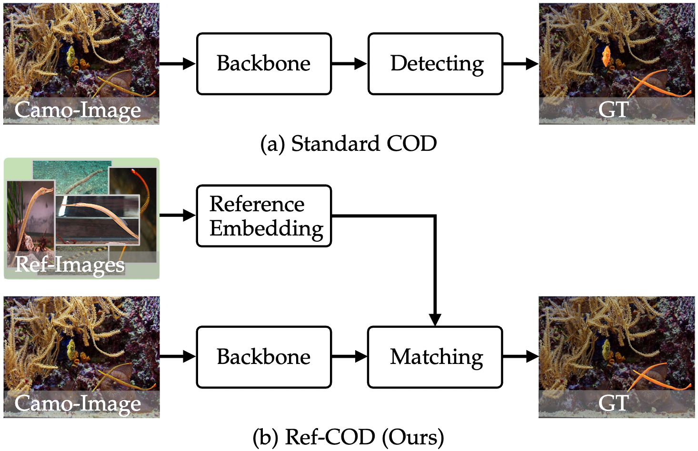

# <p align=center>`Referring Camouflaged Object Detection `</p>
> **Authors:**
> [Xuying Zhang](https://zhangxuying1004.github.io/),
> [Bowen Yin](http://yinbowen-chn.github.io/),
> [Zheng Lin](),
> [Qibin Hou](),
> [Deng-Ping Fan](), 
> [Mingming Cheng]().

&emsp; This official repository contains the dataset and source code of the paper 'Referring Camouflaged Object Detection'.   
&emsp; In this paper, we consider the problem of referring camouflaged object detection (Ref-COD), a new task that aims to segment specified
camouflaged objects based on a small set of referring images with salient target objects. 
  
<p align="center">
     <br />
    <em> 
    Figure Ref-COD: Visual comparison between the standard COD and our Ref-COD.
    Given an image containing multiple camouflaged objects, the COD
    model tends to find all possible camouflaged objects that are blended
    into the background without discrimination, while the Ref-COD model
    attempts to identify the camouflaged objects under the condition of a set
    of referring images.
    </em>
</p>

## Environment setup
```
conda env create -f environment.yml
conda activate refcod
```

## Get Start
**1. Framework**
<p align="center">
     <br />
</p>

&emsp; The Our R2CNet framework is composed of two branches, i.e., reference branch in green and segmentation branch
in orange. In the reference branch, the common representation of a specified object from images is obtained by masking and pooling the visual
features with the foreground map generated by a SOD network. In the segmentation branch, the visual features from the last three layers of the
encoder are employed to represent the given image. Then, these two kinds of feature representations are fused and compared in the well-designed
RMG module to generate a mask prior, which is used to enrich the visual feature among different scales to highlight the camouflaged targets in our
RFE module. Finally, the enriched features are fed into the decoder to generate the final segmentation map. DSF:Dual-source Information Fusion, MSF: Multi-scale Feature Fusion, TM: Target Matching.

**2. Datasets.**
- To reproduce our results, you should first download our ensembled [R2C7K](https://pan.baidu.com/s/1nAKETFmDiSm7dDLxlgH9tw) dataset with access code ```2023``` on Baidu Netdisk.
- Update the 'data_root' param with your R2C7K location in train.py and test.py.

**3. Infer.**
- Download our pre-trained [r2cnet.pth](https://pan.baidu.com/s/1VPr1YbuZthUWMRmcKxVhvA) checkpoints with access code ```2023``` on Baidu Netdisk.
- Put the checkpoint file on './snapshot/saved_models/'.
- Run ```python infer.py``` to generate the foreground maps of R2CNet.
- You can also directly refer to the predictions in [R2CNet-Maps]().

**4. Test.**
- Assert that the pre-trained [r2cnet.pth](https://pan.baidu.com/s/1VPr1YbuZthUWMRmcKxVhvA) checkpoint file has been placed in './snapshot/saved_models/'.
- Run ```python test.py``` to evaluate the performance of R2CNet.

## Acknowlegement
This repo is mainly built based on [SINet-V2](https://github.com/GewelsJI/SINet-V2) and [PFENet](https://github.com/dvlab-research/PFENet). Thanks for their great work and friendly codebases!

## Reference
If our work is helpful to you or gives some inspiration to you, please star this project and cite our paper. Thank you!  
```
@article{zhang2023referring,
  title={Referring Camouflaged Object Detection},
  author={Zhang, Xuying and Yin, Bowen and Lin, Zheng and Hou, Qibin and Fan, Deng-Ping and Cheng, Ming-Ming},
  journal={arXiv preprint arXiv:2306.07532},
  year={2023}
}
